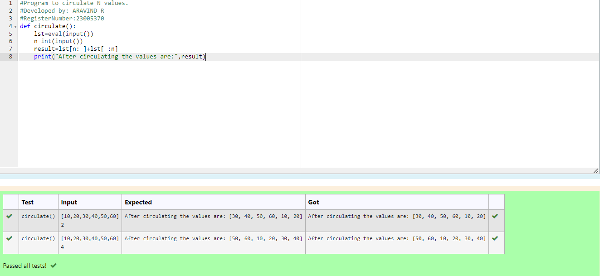

# Circulate-the-values-of-N-variables
## Aim:
To write a python program to circulate the n variables using function concept
## Equipment’s required:
PC
Anaconda - Python 3.7
## Algorithm: 
### Step 1: 
 Get the two value from the user
### Step 2: 
Assign the vaue of second variable to a temporary variable
### Step 3: 
Assign the vaue of the first variable to a second variable
### Step 4: 
Assign the vaue in temporaruy variable to a first  variable
### Step 5: 
Print both the value it would be interchanged
### Step 6: 
End the program
## Program:
```python 
#Program to circulate N values.
#Developed by: ARAVIND R
#RegisterNumber:23005370
def circulate():
    lst=eval(input())
    n=int(input())
    result=lst[n: ]+lst[ :n]
    print("After circulating the values are:",result)
```
## Output:

## Result:
The circulate a value of N variable is successfully exected
